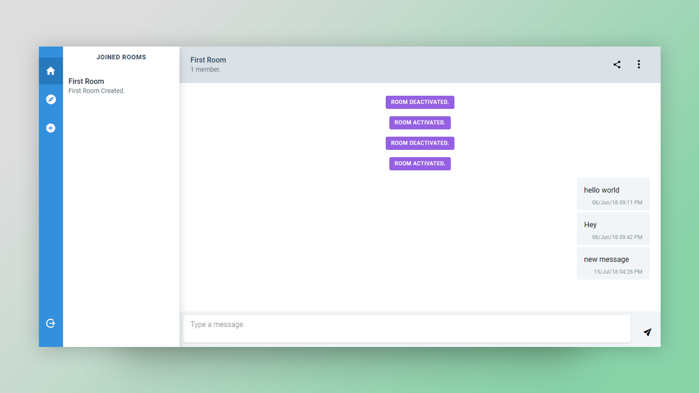

# Chat App

A web app where you can create chat rooms and invite your friends to chat with them. A user can create, delete, activate, deactivate, join and leave active chat rooms as desired.

[Click here](http://chat-app.anishghosh.me) to visit the Chat Room App.

### Screenshot



### Built With
* Angular & [Tailwind CSS](https://tailwindcss.com/) - Frontend
* Node.JS & Express - Backend
* MongoDB - Server
* Socket.IO

### Prerequisites
1. MongoDB
2. NodeJS


### Running the App

The steps you need to follow (assuming MongoDB server is running):

```shell
git clone https://github.com/anishghosh103/chat-app.git
cd chat-app/backend
npm install
node app
```
